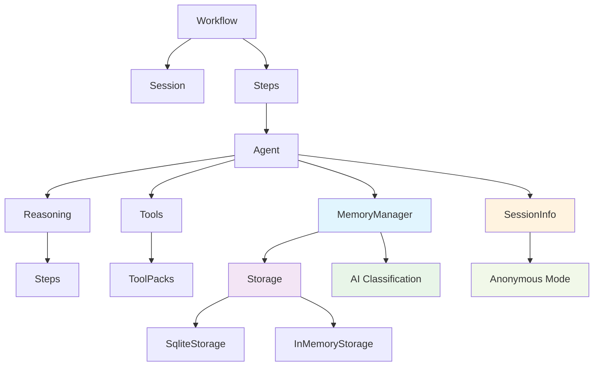

# 🤖 AgentSharp

> Framework .NET para construção de agentes de IA com raciocínio estruturado e workflows avançados

[](https://opensource.org/licenses/MIT)
[](https://docs.microsoft.com/pt-br/dotnet/standard/net-standard)
[](https://docs.microsoft.com/pt-br/dotnet/csharp/)

## 🌟 Destaques

- **Raciocínio Estruturado**: Agentes com capacidade de análise step-by-step
- **Sistema de Memória Avançado**: Gestão inteligente com classificação automática via IA
- **🧠 Busca Semântica**: Embeddings vetoriais com OpenAI + fallback inteligente
- **🚫 Deduplicação Inteligente**: Sistema que previne memórias duplicadas automaticamente
- **🔍 Busca Híbrida**: Combinação de busca textual + sinônimos + palavras-chave
- **Configuração de Domínio**: Prompts customizados para medicina, direito, tecnologia, etc. 🏥
- **Modo Anônimo**: Funcionamento sem autenticação com IDs automáticos 🎭
- **Workflows Avançados**: Sistema robusto de orquestração de agentes
- **Gerenciamento de Estado**: Sessões persistentes e thread-safe
- **Storage Plugável**: SQLite, InMemory, Vector Storage e interfaces customizadas
- **Observabilidade**: Métricas detalhadas e telemetria
- **Extensibilidade**: Sistema de plugins via Tool Packs

## 🚀 Início Rápido

```csharp
// 1. Instalar via NuGet
dotnet add package AgentSharp

// 2. Configurar storage persistente
var storage = new SqliteStorage("Data Source=agent_memory.db");
await storage.InitializeAsync();

// 3. Criar um agente com memória e raciocínio
var agent = new Agent<Context, string>(model, "AnalistaEspecialista", storage: storage)
    .WithReasoning(true)
    .WithPersona("Você é um especialista em análise de dados que lembra das preferências do usuário");

// 4. Criar um workflow
var workflow = new SequentialWorkflow<Context, string>("Análise")
    .RegisterStep("Pesquisa", pesquisador, 
        ctx => "Pesquise sobre: " + ctx.Topic,
        (ctx, res) => ctx.Dados = res)
    .RegisterStep("Análise", analista,
        ctx => "Analise: " + ctx.Dados,
        (ctx, res) => ctx.Resultado = res);

// 5. Executar
var resultado = await workflow.ExecuteAsync(contexto);

// 🏥 Configuração para Domínio Específico (Médico)
var assistenteMedico = new Agent<Context, string>(model, storage: storage)
    .WithPersona("Você é um assistente médico especializado")
    .WithMemoryCategories("Symptom", "Diagnosis", "Medication", "Treatment", "Allergy")
    .WithMemoryExtraction((userMsg, assistantMsg) => $@"
        Extraia APENAS informações clinicamente relevantes:
        Paciente: {userMsg}
        Médico: {assistantMsg}
        
        Foque em: sintomas, diagnósticos, medicamentos, alergias, tratamentos.
        JSON: {{""memories"": [{{""content"": ""..."", ""type"": ""Symptom"", ""importance"": 0.9}}]}}")
    .WithMemoryThresholds(maxMemories: 8, minImportance: 0.7);

// 🧠 Busca Semântica com Embeddings (Novo!)
var embeddingService = new OpenAIEmbeddingService(apiKey, endpoint);
var vectorStorage = new VectorSqliteStorage("memory.db", embeddingService);
await vectorStorage.InitializeAsync();

var agenteSemantico = new Agent<Context, string>(model, storage: vectorStorage)
    .WithPersona("Assistente com memória semântica avançada")
    .WithContext(context);

// Exemplo: "Como fazer café?" encontra "João prefere café forte"
// mesmo sem palavras exatas em comum!

// 🎭 Modo Anônimo (sem autenticação)
var agenteAnonimo = new Agent<object, string>(model, "Assistant")
    .WithAnonymousMode(true);
    
var result = await agenteAnonimo.ExecuteAsync("Olá!");
Console.WriteLine($"Session ID: {result.SessionInfo.SessionId}"); // ID automático
```

## 📚 Documentação

- [Guia de Início](docs/getting-started.md)
- [Conceitos Fundamentais](docs/core-concepts.md)
- [Sistema de Memória](docs/memory-system.md)
- [Configuração de Domínio](docs/memory-domain-configuration.md)
- [Busca Semântica e Embeddings](docs/semantic-search.md)
- [Modo Anônimo](docs/anonymous-mode.md) 🎭
- [Sistema de Workflows](docs/workflows.md)
- [Raciocínio Estruturado](docs/reasoning.md)
- [Exemplos Práticos](docs/examples.md)
- [API Reference](docs/api/index.md)

## 🎯 Casos de Uso

- **Assistentes Especializados**: Médicos, jurídicos, técnicos com memória customizada por domínio
- **Busca Semântica Inteligente**: Conexões conceituais sem palavras exatas
- **Análise de Dados**: Processamento estruturado com raciocínio e memória persistente
- **Prevenção de Duplicações**: Sistema inteligente que evita informações repetidas
- **Geração de Conteúdo**: Workflows multi-etapa com revisão e aprendizado
- **Automação**: Orquestração de tarefas complexas com contexto histórico
- **Atendimento ao Cliente**: Agentes que mantêm contexto entre sessões com busca avançada
- **Pesquisa**: Análise profunda com acúmulo de conhecimento contextual e embeddings
- **Aplicações Web**: Modo anônimo para usuários sem autenticação

## 🛠️ Arquitetura



## 🤝 Contribuindo

1. Fork o projeto
2. Crie sua branch (`git checkout -b feature/AmazingFeature`)
3. Commit suas mudanças (`git commit -m 'Add: feature incrível'`)
4. Push para a branch (`git push origin feature/AmazingFeature`)
5. Abra um Pull Request

## 📄 Licença

Este projeto está licenciado sob a Licença MIT - veja o arquivo [LICENSE](LICENSE) para detalhes.

## 🙏 Agradecimentos

- OpenAI pela tecnologia base
- Comunidade .NET
- Todos os contribuidores

---
Feito com 💙 em C# e IA