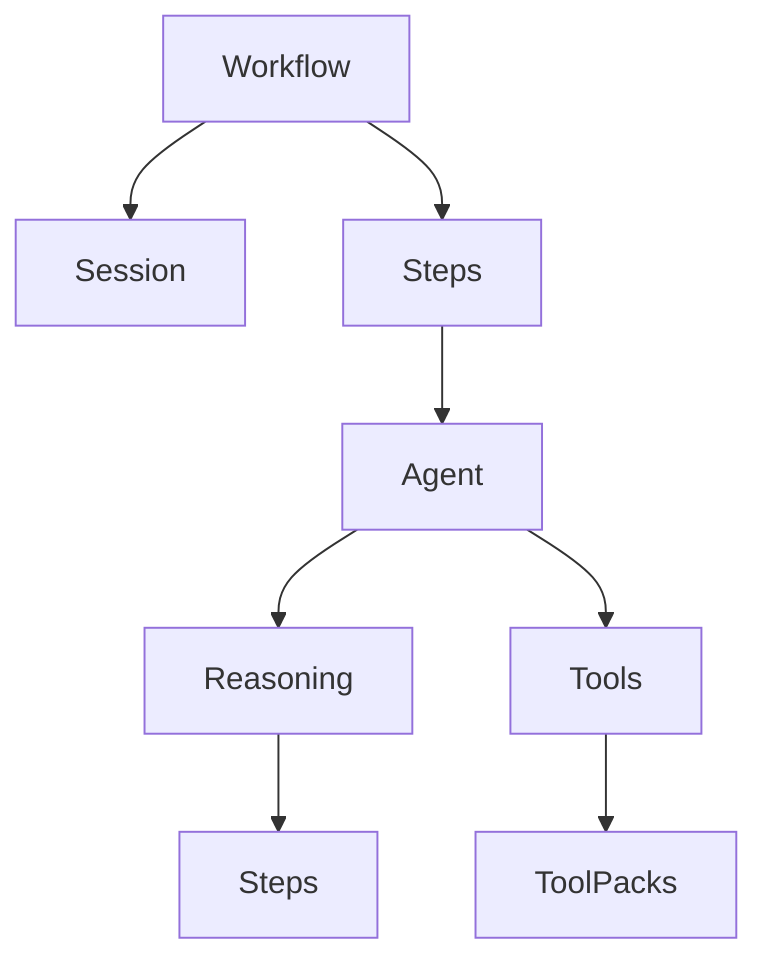

# 🤖 Agents.net

> Framework .NET para construção de agentes de IA com raciocínio estruturado e workflows avançados

[](https://opensource.org/licenses/MIT)
[](https://docs.microsoft.com/pt-br/dotnet/standard/net-standard)
[](https://docs.microsoft.com/pt-br/dotnet/csharp/)

## 🌟 Destaques

- **Raciocínio Estruturado**: Agentes com capacidade de análise step-by-step
- **Workflows Avançados**: Sistema robusto de orquestração de agentes
- **Gerenciamento de Estado**: Sessões persistentes e thread-safe
- **Observabilidade**: Métricas detalhadas e telemetria
- **Extensibilidade**: Sistema de plugins via Tool Packs

## 🚀 Início Rápido

```csharp
// 1. Instalar via NuGet
dotnet add package Agents.net

// 2. Criar um agente com raciocínio
var agent = new Agent<Context, string>(model, "AnalistaEspecialista")
    .WithReasoning(true)
    .WithPersona("Você é um especialista em análise de dados");

// 3. Criar um workflow
var workflow = new SequentialWorkflow<Context, string>("Análise")
    .RegisterStep("Pesquisa", pesquisador, 
        ctx => "Pesquise sobre: " + ctx.Topic,
        (ctx, res) => ctx.Dados = res)
    .RegisterStep("Análise", analista,
        ctx => "Analise: " + ctx.Dados,
        (ctx, res) => ctx.Resultado = res);

// 4. Executar
var resultado = await workflow.ExecuteAsync(contexto);
```

## 📚 Documentação

- [Guia de Início](docs/getting-started.md)
- [Conceitos Fundamentais](docs/core-concepts.md)
- [Sistema de Workflows](docs/workflows.md)
- [Raciocínio Estruturado](docs/reasoning.md)
- [Exemplos Práticos](docs/examples.md)
- [API Reference](docs/api/index.md)

## 🎯 Casos de Uso

- **Análise de Dados**: Processamento estruturado com raciocínio
- **Geração de Conteúdo**: Workflows multi-etapa com revisão
- **Automação**: Orquestração de tarefas complexas
- **Pesquisa**: Análise profunda com etapas estruturadas

## 🛠️ Arquitetura



## 🤝 Contribuindo

1. Fork o projeto
2. Crie sua branch (`git checkout -b feature/AmazingFeature`)
3. Commit suas mudanças (`git commit -m 'Add: feature incrível'`)
4. Push para a branch (`git push origin feature/AmazingFeature`)
5. Abra um Pull Request

## 📄 Licença

Este projeto está licenciado sob a Licença MIT - veja o arquivo [LICENSE](LICENSE) para detalhes.

## 🙏 Agradecimentos

- OpenAI pela tecnologia base
- Comunidade .NET
- Todos os contribuidores

---
Feito com 💙 em C# e IA