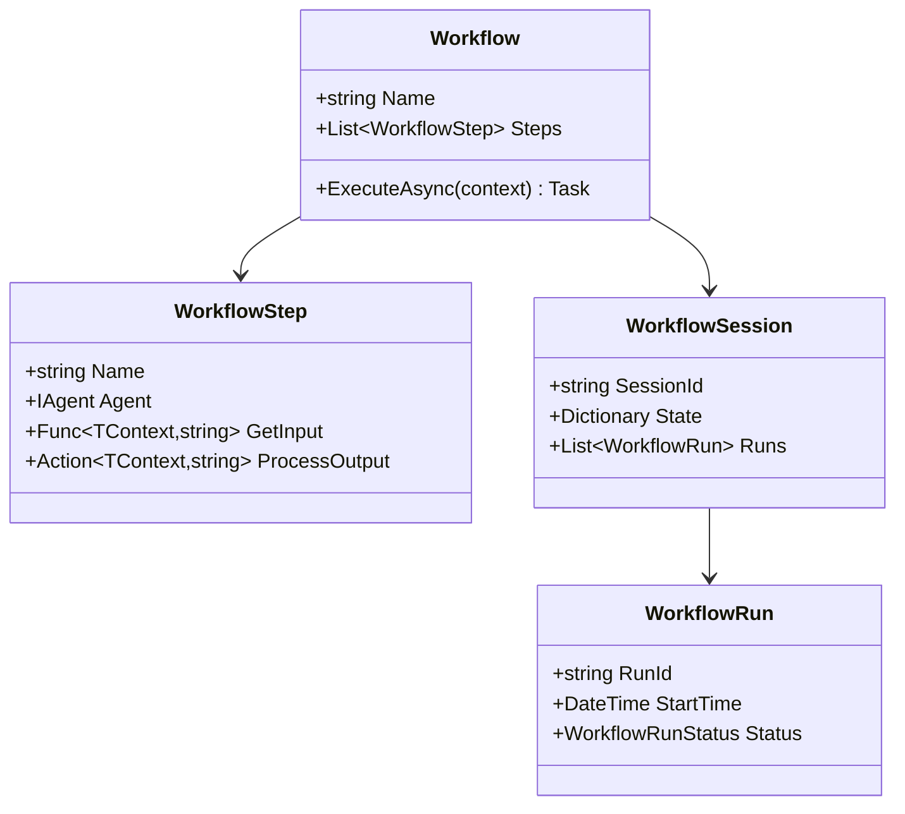

# 🔄 Sistema de Workflows

> Orquestração avançada de agentes com gerenciamento de estado e observabilidade

## 📖 Visão Geral

O sistema de workflows do AgentSharp oferece uma arquitetura robusta para orquestrar múltiplos agentes em uma sequência lógica de operações. Com suporte a gerenciamento de estado, sessões persistentes e métricas detalhadas.

## 🏗️ Arquitetura

### Componentes Principais



## 💡 Tipos de Workflow

### 1. SequentialWorkflow
Executa passos em sequência, com gerenciamento thread-safe de estado.

```csharp
var workflow = new SequentialWorkflow<Context, string>("Análise")
    .RegisterStep("Pesquisa", pesquisador, 
        ctx => "Pesquise: " + ctx.Topic,
        (ctx, res) => ctx.Dados = res)
    .RegisterStep("Análise", analista,
        ctx => "Analise: " + ctx.Dados,
        (ctx, res) => ctx.Resultado = res);
```

### 2. AdvancedWorkflow
Adiciona sessões persistentes, telemetria e observabilidade.

```csharp
var workflow = new AdvancedWorkflow<Context, string>("Workflow Avançado")
    .WithUserId("user123")
    .WithDebugMode(true)
    .WithTelemetry(true)
    .ForTask(ctx => "Objetivo: " + ctx.Meta);
```

### 3. Team Orchestration (Novo)
Sistema avançado para coordenação de múltiplos agentes em diferentes modos de trabalho.

```csharp
var team = new IAgent[] { projectManager, developer, designer };

// Modo Coordinate - todos os agentes trabalham juntos
var coordinateWorkflow = new AdvancedWorkflow<string, string>("TeamCoordinate")
    .AsTeam(team, TeamMode.Coordinate)
    .WithMemory(new InMemoryStore());

// Modo Route - roteamento inteligente por capacidade
var routeWorkflow = new AdvancedWorkflow<string, string>("TeamRoute")
    .AsTeam(team, TeamMode.Route)
    .AddCapabilityBasedRouting("task", team, new Dictionary<string, string[]>
    {
        ["ProjectManager"] = new[] { "planning", "coordination", "strategy" },
        ["Developer"] = new[] { "coding", "implementation", "debugging" },
        ["Designer"] = new[] { "ui", "ux", "design", "mockup" }
    });

// Modo Collaborate - todos contribuem e síntese final
var collaborateWorkflow = new AdvancedWorkflow<string, string>("TeamCollaborate")
    .AsTeam(team, TeamMode.Collaborate)
    .WithMemory(new InMemoryStore());
```

## 📊 Gerenciamento de Estado

### Sessões
- Persistência de estado entre execuções
- Histórico de runs
- Métricas e telemetria

```csharp
// Criar nova sessão
workflow.CreateNewSession("Sessão-001");

// Salvar estado
session.UpdateState("dados", resultado);

// Recuperar estado
var dados = session.GetState<string>("dados");
```

### Thread Safety
- Locks para operações críticas
- Controle de execução paralela
- Estado isolado por execução

```csharp
// Thread-safe por design
public TContext Context
{
    get { lock (_contextLock) { return _context; } }
    set { lock (_contextLock) { _context = value; } }
}
```

## 📈 Observabilidade

### Métricas
- Tempo de execução
- Taxa de sucesso
- Uso de recursos

```csharp
var metrics = workflow.GetMetrics();
Console.WriteLine($"Taxa de sucesso: {metrics.SuccessRate:P2}");
Console.WriteLine($"Tempo médio: {metrics.AverageExecutionTime}");
```

### Debug Mode
- Logs detalhados
- Rastreamento de execução
- Breakpoints em passos

```csharp
workflow.WithDebugMode(true);
// Log detalhado de cada passo
_logger.Log(LogLevel.Debug, $"Executando passo: {step.Name}");
```

## 🔄 Ciclo de Vida

1. **Inicialização**
   - Criação do workflow
   - Configuração de passos
   - Setup de sessão

2. **Execução**
   - Preparação do contexto
   - Execução dos passos
   - Coleta de métricas

3. **Finalização**
   - Persistência de estado
   - Geração de relatórios
   - Cleanup de recursos

## 🛠️ Melhores Práticas

### Design de Workflows
- Mantenha passos atômicos
- Use tipos fortemente tipados
- Implemente tratamento de erros

### Gerenciamento de Estado
- Persista dados críticos
- Use sessões para continuidade
- Monitore uso de memória

### Observabilidade
- Ative debug mode em dev
- Configure logs apropriados
- Monitore métricas chave

## 📚 Exemplos Práticos

### Workflow de Análise
```csharp
var workflow = new AdvancedWorkflow<AnaliseContext, Report>("Análise")
    .WithDebugMode(true)
    .RegisterStep("Coleta", coletorDados,
        ctx => $"Coletar dados de {ctx.Fonte}",
        (ctx, res) => ctx.DadosBrutos = res)
    .RegisterStep("Processamento", processador,
        ctx => $"Processar: {ctx.DadosBrutos}",
        (ctx, res) => ctx.DadosProcessados = res)
    .RegisterStep("Relatório", gerador,
        ctx => $"Gerar relatório: {ctx.DadosProcessados}",
        (ctx, res) => ctx.Relatorio = res);
```

### Workflow com Retry
```csharp
var workflow = new AdvancedWorkflow<Context, Result>("Resiliente")
    .WithRetry(maxAttempts: 3)
    .RegisterStep("API", apiClient,
        ctx => "Chamar API",
        (ctx, res) => ctx.ApiResult = res,
        onError: async (ctx, ex) => await HandleError(ex));
```

## 🔍 Debugging

### Logs Detalhados
```csharp
_logger.Log(LogLevel.Debug, new
{
    Step = step.Name,
    Input = input,
    Context = context,
    Timestamp = DateTime.UtcNow
});
```

### Métricas em Tempo Real
```csharp
workflow.OnStepComplete += (step, metrics) =>
{
    Console.WriteLine($"Passo {step.Name}: {metrics.Duration}ms");
    Console.WriteLine($"Memória: {metrics.MemoryUsage}MB");
};
```

## 🎯 Próximos Passos

1. **Explore os Exemplos**
   - Veja `ExemplosWorkflow.cs`
   - Teste diferentes configurações
   - Experimente com seus casos

2. **Configure Observabilidade**
   - Ative debug mode
   - Configure logs
   - Monitore métricas

3. **Implemente Seus Workflows**
   - Planeje os passos
   - Defina o contexto
   - Implemente handlers

---

# 🤝 Team Orchestration

## 📖 Visão Geral

O sistema de Team Orchestration permite coordenar múltiplos agentes especializados para trabalhar em conjunto, oferecendo diferentes modos de colaboração e ferramentas avançadas de comunicação entre agentes.

## 🎯 Modos de Trabalho

### Coordinate Mode
Todos os agentes participam da discussão e tomada de decisão em conjunto.

```csharp
var team = new IAgent[] { projectManager, developer, designer };
var workflow = new AdvancedWorkflow<string, string>("TeamCoordinate")
    .AsTeam(team, TeamMode.Coordinate)
    .WithMemory(new InMemoryStore());

var result = await workflow.ExecuteAsync("Desenvolver aplicação de e-commerce");
```

### Route Mode
Roteia tarefas para o agente mais adequado baseado em diferentes estratégias.

#### Capability-Based Routing
Roteia baseado nas capacidades de cada agente.

```csharp
var workflow = new AdvancedWorkflow<string, string>("TeamRoute")
    .AsTeam(team, TeamMode.Route)
    .AddCapabilityBasedRouting("dev_task", team, new Dictionary<string, string[]>
    {
        ["SecurityExpert"] = new[] { "security", "vulnerability", "threat" },
        ["NetworkAdmin"] = new[] { "network", "infrastructure", "server" },
        ["DevOpsEngineer"] = new[] { "deployment", "automation", "pipeline" }
    });
```

#### Performance-Based Routing
Roteia para o agente com melhor performance.

```csharp
var performanceMetrics = new Dictionary<string, double>
{
    ["Agent1"] = 7.5,
    ["Agent2"] = 9.2, // Será escolhido
    ["Agent3"] = 6.8
};

var workflow = new AdvancedWorkflow<string, string>("PerformanceRoute")
    .AsTeam(team, TeamMode.Route)
    .AddPerformanceBasedRouting("critical_task", team, performanceMetrics);
```

#### Round-Robin Routing
Distribui tarefas igualmente entre os agentes.

```csharp
var workflow = new AdvancedWorkflow<string, string>("LoadBalanced")
    .AsTeam(team, TeamMode.Route)
    .AddRoundRobinRouting("balanced_task", team);
```

### Collaborate Mode
Todos os agentes contribuem individualmente, e o resultado é sintetizado.

```csharp
var workflow = new AdvancedWorkflow<string, string>("TeamCollaborate")
    .AsTeam(team, TeamMode.Collaborate)
    .WithMemory(new InMemoryStore());

var result = await workflow.ExecuteAsync("Analisar mercado de tecnologia sustentável");
```

## 🛠️ Team Handoff Tools

Sistema de ferramentas para comunicação e coordenação entre agentes.

### Configuração Básica

```csharp
var memoryManager = new MemoryManager(storage, model, logger);
var teamAgents = new IAgent[] { projectManager, developer, designer };
var handoffTools = new TeamHandoffToolPack(teamAgents, memoryManager, "my-team");

// Registrar ferramentas nos agentes
foreach (var agent in teamAgents.Cast<Agent<string, string>>())
{
    agent.WithTools(handoffTools);
}

await handoffTools.InitializeAsync();
```

### Funcionalidades Disponíveis

#### 1. Handoff de Tarefas
```csharp
// Agent pode delegar tarefa para outro agente
await handoffTools.HandoffTask(
    "Developer", 
    "Implementar sistema de autenticação", 
    "Necessário conhecimento técnico específico",
    "High");
```

#### 2. Consulta entre Agentes
```csharp
// Agent pode consultar outro agente
await handoffTools.ConsultAgent(
    "Designer", 
    "Qual a melhor abordagem UX para login social?");
```

#### 3. Compartilhamento de Informações
```csharp
// Compartilhar informação com toda equipe
await handoffTools.ShareWithTeam(
    "Requisitos do cliente finalizados. Prazo: 30 dias", 
    "requirements");
```

#### 4. Atualizações de Status
```csharp
// Atualizar progresso da equipe
await handoffTools.UpdateTeamStatus(
    "Backend API development completed", 
    85, 
    "Starting frontend integration");
```

#### 5. Contexto da Equipe
```csharp
// Obter contexto atualizado da equipe
var context = await handoffTools.GetTeamContext(10);
Console.WriteLine(context);
```

#### 6. Lista de Agentes
```csharp
// Listar agentes disponíveis
var agents = handoffTools.ListTeamAgents();
Console.WriteLine(agents);
```

## 💾 Persistência e Memória

### Compartilhamento de Memória
Os agentes podem compartilhar memória através do `MemoryManager`:

```csharp
var sharedStorage = new SqliteStorage("Data Source=team_memory.db");
await sharedStorage.InitializeAsync();

var memoryManager = new MemoryManager(sharedStorage, model, logger);

// Todos os agentes compartilham a mesma base de dados
var agent1 = new Agent<string, string>(model, "Agent1", storage: sharedStorage);
var agent2 = new Agent<string, string>(model, "Agent2", storage: sharedStorage);
```

### Contexto Persistente
As informações da equipe são persistidas automaticamente:

```csharp
// Primeira sessão
var handoffTools1 = new TeamHandoffToolPack(team, memoryManager, "project-alpha");
await handoffTools1.ShareWithTeam("Initial setup completed", "setup");

// Segunda sessão (após restart)
var handoffTools2 = new TeamHandoffToolPack(team, memoryManager, "project-alpha");
var history = await handoffTools2.GetTeamContext(5); // Recupera histórico
```

## 🔄 Workflows Integrados

### Workflow com Team Handoff Tools

```csharp
var teamAgents = new IAgent[] { productOwner, techLead, developer };
var handoffTools = new TeamHandoffToolPack(teamAgents, memoryManager, "dev-team");

// Registrar ferramentas em cada agente
foreach (var agent in teamAgents.Cast<Agent<string, string>>())
{
    agent.WithTools(handoffTools);
}

var workflow = new AdvancedWorkflow<string, string>("IntegratedTeam")
    .AsTeam(teamAgents, TeamMode.Coordinate)
    .WithMemory(new InMemoryStore());

await handoffTools.InitializeAsync();

var result = await workflow.ExecuteAsync(@"
    FEATURE REQUEST: Sistema de Notificações
    - Notificações por email
    - Notificações in-app em tempo real  
    - Preferências do usuário
    - Analytics de entrega
    PRAZO: 4 semanas
");
```

## 📊 Monitoramento e Métricas

### Performance de Equipe
```csharp
// Workflow com métricas de equipe
var workflow = new AdvancedWorkflow<string, string>("TeamMetrics")
    .AsTeam(largeTeam, TeamMode.Route)
    .WithTelemetry(true)
    .WithDebugMode(true);

var startTime = DateTime.UtcNow;
var result = await workflow.ExecuteAsync("Complex team task");
var duration = DateTime.UtcNow - startTime;

Console.WriteLine($"Team execution time: {duration.TotalSeconds}s");
```

### Teste de Escalabilidade
```csharp
// Teste com equipe grande
var agents = new IAgent[8];
for (int i = 0; i < 8; i++)
{
    agents[i] = new Agent<string, string>(model, $"TeamMember{i+1}")
        .WithPersona($"Especialista em área {i+1}");
}

var workflow = new AdvancedWorkflow<string, string>("LargeTeam")
    .AsTeam(agents, TeamMode.Route)
    .AddRoundRobinRouting("distributed_task", agents);
```

## 🎯 Casos de Uso

### 1. Equipe de Desenvolvimento
```csharp
var devTeam = new IAgent[]
{
    new Agent<string, string>(model, "TeamLead")
        .WithPersona("Líder técnico experiente"),
    new Agent<string, string>(model, "FrontendDev")
        .WithPersona("Especialista em React e TypeScript"),
    new Agent<string, string>(model, "BackendDev")
        .WithPersona("Especialista em .NET e APIs")
};

var workflow = new AdvancedWorkflow<string, string>("DevTeam")
    .AsTeam(devTeam, TeamMode.Coordinate);
```

### 2. Equipe de Pesquisa
```csharp
var researchTeam = new IAgent[]
{
    new Agent<string, string>(model, "MarketResearcher")
        .WithPersona("Especialista em análise de mercado"),
    new Agent<string, string>(model, "DataAnalyst")
        .WithPersona("Especialista em análise de dados"),
    new Agent<string, string>(model, "TrendAnalyst")
        .WithPersona("Especialista em tendências")
};

var workflow = new AdvancedWorkflow<string, string>("Research")
    .AsTeam(researchTeam, TeamMode.Collaborate);
```

### 3. Suporte Técnico
```csharp
var supportTeam = new IAgent[]
{
    new Agent<string, string>(model, "SecurityExpert"),
    new Agent<string, string>(model, "NetworkAdmin"),
    new Agent<string, string>(model, "DevOpsEngineer")
};

var workflow = new AdvancedWorkflow<string, string>("TechSupport")
    .AsTeam(supportTeam, TeamMode.Route)
    .AddCapabilityBasedRouting("support_ticket", supportTeam, capabilities);
```

## 🔧 Tratamento de Erros

### Agentes Indisponíveis
```csharp
// O sistema trata automaticamente agentes não encontrados
var result = await handoffTools.ConsultAgent("UnknownAgent", "Question");
// Retorna: "Agent 'UnknownAgent' not found in team. Available agents: Agent1, Agent2..."
```

### Falhas de Comunicação
```csharp
// Retry automático e fallback
var workflow = new AdvancedWorkflow<string, string>("Resilient")
    .AsTeam(team, TeamMode.Route)
    .WithRetry(maxAttempts: 3)
    .WithFallback(context => "Default response when team fails");
```

## 🎯 Próximos Passos

1. **Experimente os Modos**
   - Teste Coordinate para brainstorming
   - Use Route para especialização
   - Aplique Collaborate para análises

2. **Configure Team Handoff**
   - Registre as ferramentas
   - Teste comunicação entre agentes
   - Monitore persistência

3. **Otimize Performance**
   - Ajuste routing strategies
   - Monitore métricas de equipe
   - Escale conforme necessário

---

## 📚 Recursos Relacionados

- [Conceitos Fundamentais](core-concepts.md)
- [API Reference](api/index.md)
- [Exemplos](examples.md) 