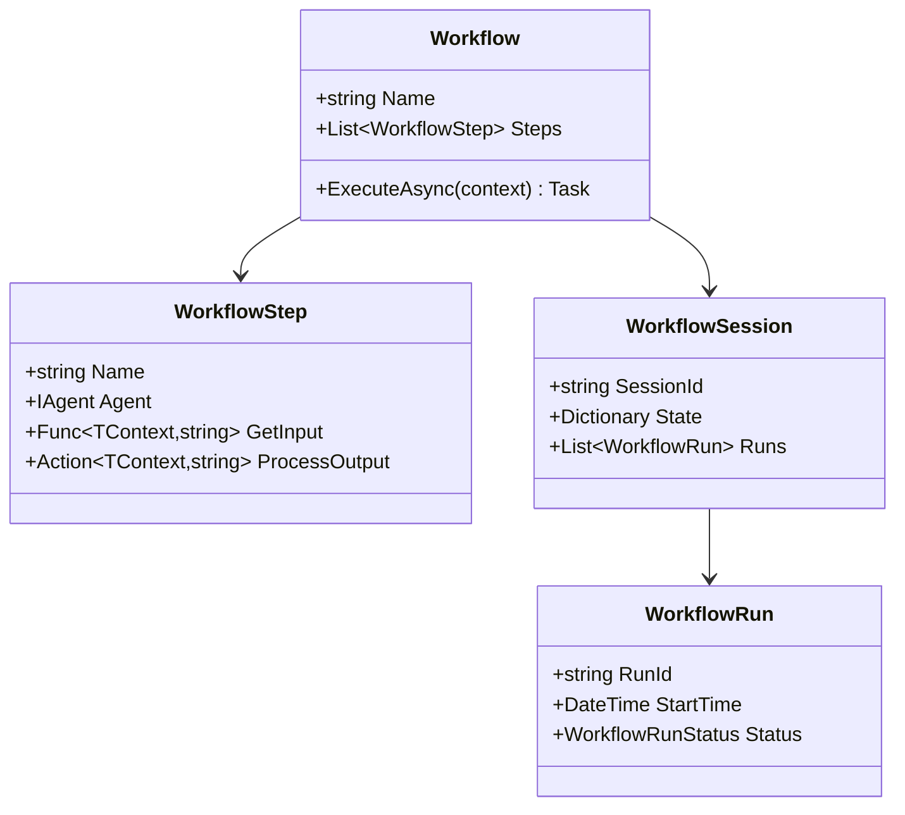

# 🔄 Sistema de Workflows

> Orquestração avançada de agentes com gerenciamento de estado e observabilidade

## 📖 Visão Geral

O sistema de workflows do AgentSharp oferece uma arquitetura robusta para orquestrar múltiplos agentes em uma sequência lógica de operações. Com suporte a gerenciamento de estado, sessões persistentes e métricas detalhadas.

## 🏗️ Arquitetura

### Componentes Principais



## 💡 Tipos de Workflow

### 1. SequentialWorkflow
Executa passos em sequência, com gerenciamento thread-safe de estado.

```csharp
var workflow = new SequentialWorkflow<Context, string>("Análise")
    .RegisterStep("Pesquisa", pesquisador, 
        ctx => "Pesquise: " + ctx.Topic,
        (ctx, res) => ctx.Dados = res)
    .RegisterStep("Análise", analista,
        ctx => "Analise: " + ctx.Dados,
        (ctx, res) => ctx.Resultado = res);
```

### 2. AdvancedWorkflow
Adiciona sessões persistentes, telemetria e observabilidade.

```csharp
var workflow = new AdvancedWorkflow<Context, string>("Workflow Avançado")
    .WithUserId("user123")
    .WithDebugMode(true)
    .WithTelemetry(true)
    .ForTask(ctx => "Objetivo: " + ctx.Meta);
```

## 📊 Gerenciamento de Estado

### Sessões
- Persistência de estado entre execuções
- Histórico de runs
- Métricas e telemetria

```csharp
// Criar nova sessão
workflow.CreateNewSession("Sessão-001");

// Salvar estado
session.UpdateState("dados", resultado);

// Recuperar estado
var dados = session.GetState<string>("dados");
```

### Thread Safety
- Locks para operações críticas
- Controle de execução paralela
- Estado isolado por execução

```csharp
// Thread-safe por design
public TContext Context
{
    get { lock (_contextLock) { return _context; } }
    set { lock (_contextLock) { _context = value; } }
}
```

## 📈 Observabilidade

### Métricas
- Tempo de execução
- Taxa de sucesso
- Uso de recursos

```csharp
var metrics = workflow.GetMetrics();
Console.WriteLine($"Taxa de sucesso: {metrics.SuccessRate:P2}");
Console.WriteLine($"Tempo médio: {metrics.AverageExecutionTime}");
```

### Debug Mode
- Logs detalhados
- Rastreamento de execução
- Breakpoints em passos

```csharp
workflow.WithDebugMode(true);
// Log detalhado de cada passo
_logger.Log(LogLevel.Debug, $"Executando passo: {step.Name}");
```

## 🔄 Ciclo de Vida

1. **Inicialização**
   - Criação do workflow
   - Configuração de passos
   - Setup de sessão

2. **Execução**
   - Preparação do contexto
   - Execução dos passos
   - Coleta de métricas

3. **Finalização**
   - Persistência de estado
   - Geração de relatórios
   - Cleanup de recursos

## 🛠️ Melhores Práticas

### Design de Workflows
- Mantenha passos atômicos
- Use tipos fortemente tipados
- Implemente tratamento de erros

### Gerenciamento de Estado
- Persista dados críticos
- Use sessões para continuidade
- Monitore uso de memória

### Observabilidade
- Ative debug mode em dev
- Configure logs apropriados
- Monitore métricas chave

## 📚 Exemplos Práticos

### Workflow de Análise
```csharp
var workflow = new AdvancedWorkflow<AnaliseContext, Report>("Análise")
    .WithDebugMode(true)
    .RegisterStep("Coleta", coletorDados,
        ctx => $"Coletar dados de {ctx.Fonte}",
        (ctx, res) => ctx.DadosBrutos = res)
    .RegisterStep("Processamento", processador,
        ctx => $"Processar: {ctx.DadosBrutos}",
        (ctx, res) => ctx.DadosProcessados = res)
    .RegisterStep("Relatório", gerador,
        ctx => $"Gerar relatório: {ctx.DadosProcessados}",
        (ctx, res) => ctx.Relatorio = res);
```

### Workflow com Retry
```csharp
var workflow = new AdvancedWorkflow<Context, Result>("Resiliente")
    .WithRetry(maxAttempts: 3)
    .RegisterStep("API", apiClient,
        ctx => "Chamar API",
        (ctx, res) => ctx.ApiResult = res,
        onError: async (ctx, ex) => await HandleError(ex));
```

## 🔍 Debugging

### Logs Detalhados
```csharp
_logger.Log(LogLevel.Debug, new
{
    Step = step.Name,
    Input = input,
    Context = context,
    Timestamp = DateTime.UtcNow
});
```

### Métricas em Tempo Real
```csharp
workflow.OnStepComplete += (step, metrics) =>
{
    Console.WriteLine($"Passo {step.Name}: {metrics.Duration}ms");
    Console.WriteLine($"Memória: {metrics.MemoryUsage}MB");
};
```

## 🎯 Próximos Passos

1. **Explore os Exemplos**
   - Veja `ExemplosWorkflow.cs`
   - Teste diferentes configurações
   - Experimente com seus casos

2. **Configure Observabilidade**
   - Ative debug mode
   - Configure logs
   - Monitore métricas

3. **Implemente Seus Workflows**
   - Planeje os passos
   - Defina o contexto
   - Implemente handlers

---

## 📚 Recursos Relacionados

- [Conceitos Fundamentais](core-concepts.md)
- [API Reference](api/index.md)
- [Exemplos](examples.md) 